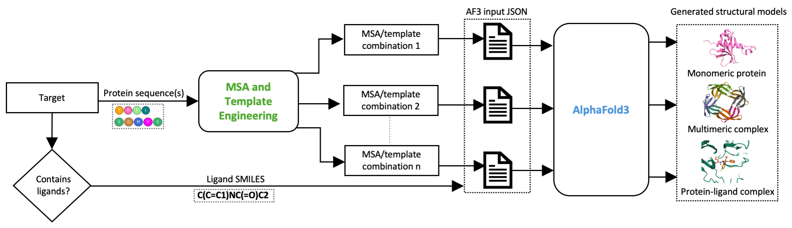

# Custom AF3 (CAF3)
Engineering Multiple Sequence Alignments and Templates to Improve AlphaFold3 for Protein and Ligand Structure Prediction.

## The pipeline of CAF3


## Data Repository 
The datasets used in CAF3 can be downloaded from Harvard Dataverse using following link: 

Input information (MSA+template combinations) : https://doi.org/10.7910/DVN/KGWHRE
Structural models generated using the input information : https://doi.org/10.7910/DVN/XJIMQN

# Installation and Configuration

## The CAF3 installation requires four steps:
### 1. Download CAF3 package
```
git clone https://github.com/BioinfoMachineLearning/CAF3.git
cd CAF3
pip install biopython pandas
```

### 2. AlphaFold3 installation. (Skip to step 3 if AlphaFold3 has already been installed)
### Begin with the installation of AlphaFold3 program using the following. 
https://github.com/google-deepmind/alphafold3/blob/main/docs/installation.md

Test whether AlphaFold3 program is working properly.
Once you have installed AlphaFold3, you can test your setup using e.g. the
following input JSON file named `fold_input.json`:

```json
{
  "name": "2PV7",
  "sequences": [
    {
      "protein": {
        "id": ["A", "B"],
        "sequence": "GMRESYANENQFGFKTINSDIHKIVIVGGYGKLGGLFARYLRASGYPISILDREDWAVAESILANADVVIVSVPINLTLETIERLKPYLTENMLLADLTSVKREPLAKMLEVHTGAVLGLHPMFGADIASMAKQVVVRCDGRFPERYEWLLEQIQIWGAKIYQTNATEHDHNMTYIQALRHFSTFANGLHLSKQPINLANLLALSSPIYRLELAMIGRLFAQDAELYADIIMDKSENLAVIETLKQTYDEALTFFENNDRQGFIDAFHKVRDWFGDYSEQFLKESRQLLQQANDLKQG"
      }
    }
  ],
  "modelSeeds": [1],
  "dialect": "alphafold3",
  "version": 1
}
```

You can then run AlphaFold 3 using the following command and check whether AlphaFold3 is running correctly:

```
docker run -it \
    --volume $HOME/af_input:/root/af_input \
    --volume $HOME/af_output:/root/af_output \
    --volume <MODEL_PARAMETERS_DIR>:/root/models \
    --volume <DATABASES_DIR>:/root/public_databases \
    --gpus all \
    alphafold3 \
    python run_alphafold.py \
    --json_path=/root/af_input/fold_input.json \
    --model_dir=/root/models \
    --output_dir=/root/af_output
```

### 3. MULTICOM4 installation.
### Begin with the installation of MULTICOM4 program using the following. 
https://github.com/BioinfoMachineLearning/MULTICOM4

Test whether MULTICOM4 program is working properly.

Example
```
sh bin/monomer/run_monomer.sh <option_file> <fasta_path> <output_dir>
```

```
sh bin/multimer/run_multimer.sh <option_file> <fasta_path> <output_dir>
```

We will use the output_dir of MULTICOM4 to obtain the MSAs and templates information to run CAF3. 


### 4. Configure databases and tools for CAF3. 

In common/config.py for both monomer and multimer, set the following paths:

```
af3_program_path = "/path/to/alphafold3_program"
af3_params_path = "/path/to/alphafold3_parameters"
af3_db_path = "/path/to/alphafold3_database"
env_dir = "/path/to/multicom4_env/bin/"
database_dir = "/path/to/multicom4_database"
```

### 5. Run CAF3. 

## Monomer example:
```bash
cd monomer

python run_monomer.py --input_fasta /path/to/T1207.fasta --target_workdir /path/to/multicom4_outputs/T1207/ --num_models 20 --output_path /path/to/outputs/
```

## Multimer example:

```bash

cd multimer

python run_multimer.py --input_fasta /path/to/H1202.fasta --target_workdir /path/to/multicom4_outputs/H1202/ --num_models 20 --output_path /path/to/outputs/

```

These script will run all the required steps to run AlphaFold3 with custom inputs. The output folder will have following information:
  - input_files/ : it contains all the information (MSA + template) needed to form the json files which is required by AlphaFold3. 
       
        Example:
        T1207/input_files:
            - msas/
                - default_seq_temp_alignments.a3m
            - templates/
                - default_seq_temp_templates.csv
            - default_seq_temp.json


  - inference_scripts/ : it contains the docker scripts needed to run the prediction for each combination. 

        Example:
        T1207/inference_scripts:
            - default_seq_temp.sh

    - One can start the AlphaFold3-based structural model prediction using :


        ```bash

        sh /path/to/inference_scripts/default_seq_temp.sh

        ```

  - outputs/ : path where the AlphaFold3 predictions will be saved. 


  ## Citing This Work

If you find this work useful, please cite: 

<!-- Neupane, P., Liu, J., & Cheng, J. (2026). Improving AlphaFold3 by Engineering MSA and Template Inputs. bioRxiv, 2026-01 () -->

<!-- ```bibtex
@article {Liu2025.01.12.632663,
	author = {Liu, Jian and Neupane, Pawan and Cheng, Jianlin},
	title = {Accurate Prediction of Protein Complex Stoichiometry by Integrating AlphaFold3 and Template Information},
	elocation-id = {2025.01.12.632663},
	year = {2025},
	doi = {10.1101/2025.01.12.632663},
	publisher = {Cold Spring Harbor Laboratory},
	URL = {https://www.biorxiv.org/content/10.1101/2025.01.12.632663v3},
	journal = {bioRxiv}
}
``` -->

```bibtex
@article {Neupane2026Improving,
	author = {Neupane, Pawan and Liu, Jian and Cheng, Jianlin},
	title = {Improving AlphaFold3 by Engineering MSA and Template Inputs},
}
```
